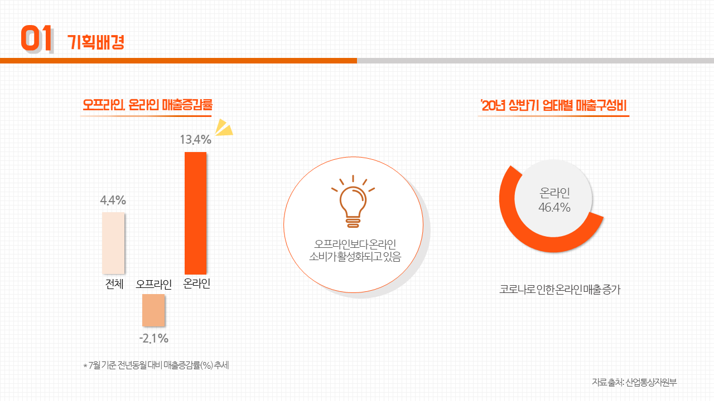
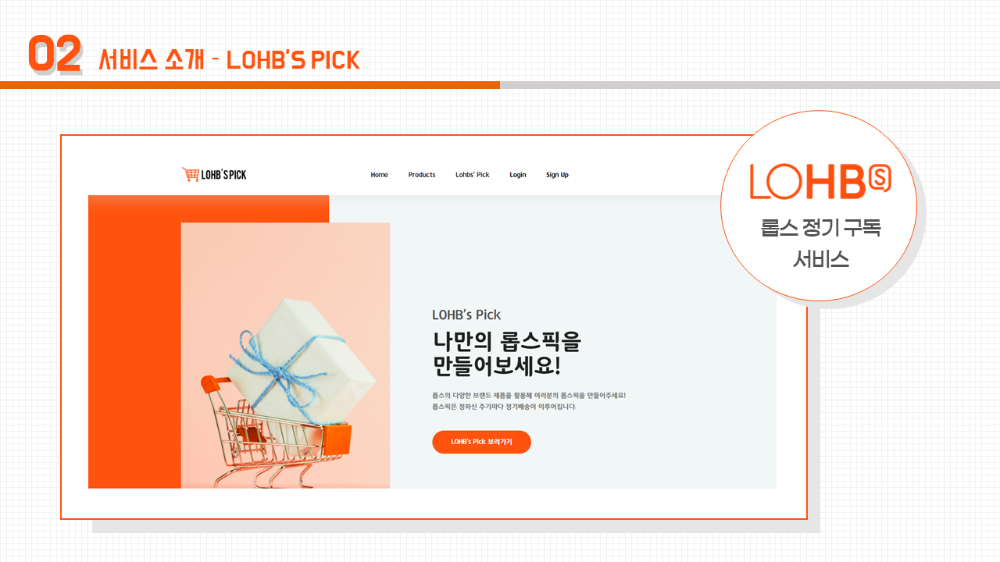
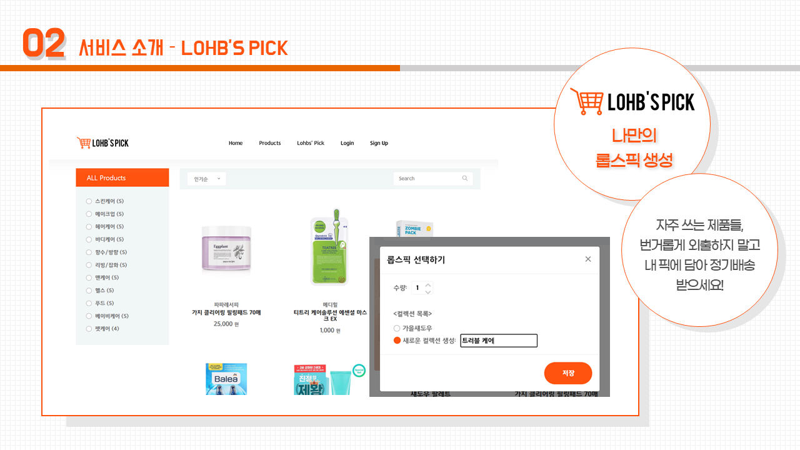
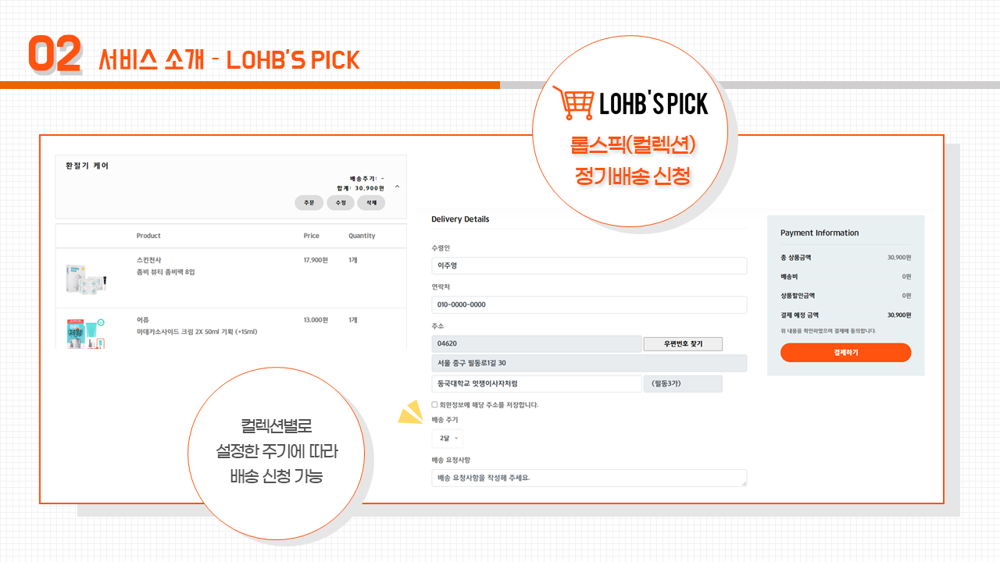
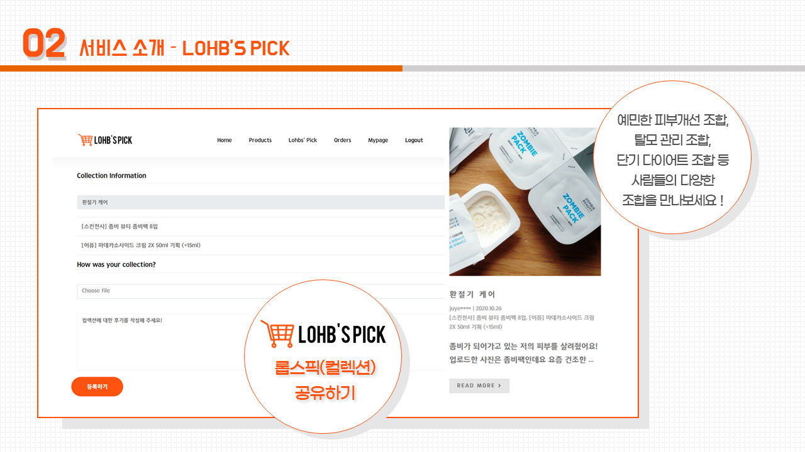
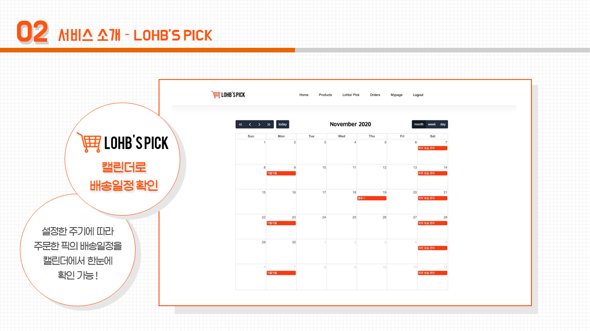
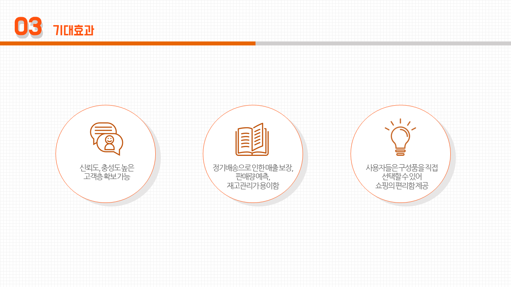

# LOHB'S Pick  
사이트 : http://lohbs-pick.site

## 서비스 소개
### 기획배경

### 기능

### 기대효과

## 개발환경  
- Python 3.7.3  
- Django 3.0.6  

## 배포환경  
- Ubuntu Server 18.04 LTS (HVM)  
- Nginx 1.14.0  

## 개발자
[동국대학교 멋쟁이사자처럼](https://www.facebook.com/DGUlion/)
- [김연진](https://github.com/ygk313)
- [김효정](https://github.com/khj6165)
- [이주영](https://github.com/JuYeong0413)
